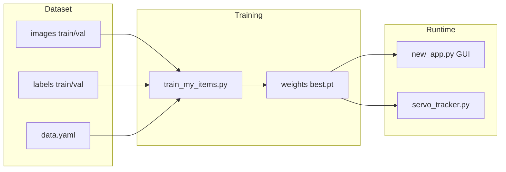

# Detection — custom YOLO webcam project

This repository is a small **computer vision** workspace built around [Ultralytics YOLOv8](https://github.com/ultralytics/ultralytics). It trains a detector on your own images, runs **live detection from a webcam**, and includes an optional **servo + Arduino** path so detections can drive hardware.

If you are new to the repo, read this file top to bottom once; it explains purpose, layout, setup, and how each script fits together.

---

## What the project does

1. **Train** a YOLO object-detection model on a dataset of images and bounding-box labels (`datasets/my_items`).
2. **Run** the trained weights (`.pt`) on a webcam: draw boxes, show class names and confidence, and show a simple “target found” indicator in a desktop app (`new_app.py`).
3. **Optionally** stream servo angle commands over USB serial to an Arduino (`servo_tracker.py` + `servo_tracker_arduino.ino`).

The example dataset is configured for **one class** named `yellow daifuku` (see `datasets/my_items/data.yaml`). The GUI highlights when that label appears in a detection (case-insensitive substring match on the class name). You can change classes and retrain; the same scripts apply.

---

## Repository layout (high level)

| Path | Role |
|------|------|
| `datasets/my_items/` | YOLO-format dataset: `images/train`, `images/val`, `labels/train`, `labels/val`, and `data.yaml`. |
| `train_my_items.py` | Trains YOLOv8n on `datasets/my_items/data.yaml`; writes runs under `runs/`. |
| `new_app.py` | **Desktop app** (PySide6): webcam → background inference thread → annotated video + FPS + confidence slider. |
| `servo_tracker.py` | Webcam + YOLO; sends `ANGLE:<degrees>\n` over serial (or `--dry-run` to print only). |
| `servo_tracker_arduino.ino` | Arduino sketch: parses serial lines (`1`/`0`, `DET:1`, `ANGLE:90`, etc.) and moves a servo. |
| `make_val_from_train.py` | Utility to move or copy random image/label pairs from train into val (helps build a validation split). |
| `dependencies.py` | Installs Python packages used by the scripts (`ultralytics`, `opencv-python`, `pyside6`, `pyserial`). |
| `runs/` | Training outputs (weights, metrics, args). Typical weights path: `runs/detect/runs/<run_name>/weights/best.pt`. |

Large folders like `datasets/.../images` and `runs/` are **data and artifacts**, not application source.

---

## Requirements

- **Python 3** (3.9+ is typical for current Ultralytics stacks; use what your environment supports).
- **Windows** is assumed in places (e.g. `cv2.CAP_DSHOW` in `new_app.py` and default `COM3` in `servo_tracker.py`). On Linux/macOS you may need to adjust the camera backend and serial port name.
- A **webcam** for live demos.
- **Optional**: CUDA-capable GPU for faster training/inference (Ultralytics will use it when configured; CPU still works, more slowly).

---

## Setup

From the project root:

```bash
python dependencies.py
```

That installs (if missing): `ultralytics`, `opencv-python`, `pyside6`, `pyserial`.

YOLO may also download base weights (for example `yolov8n.pt`) on first train or predict.

---

## Dataset and training

### Layout (YOLO detection)

Under `datasets/my_items/`:

- `images/train`, `images/val` — image files (`.jpg`, `.png`, etc.).
- `labels/train`, `labels/val` — one `.txt` per image, same stem as the image file, with lines:  
  `class_id x_center y_center width height` (all normalized 0–1 relative to image size).

`data.yaml` tells Ultralytics where images are and what the class names are. **If you clone this repo on another machine**, open `datasets/my_items/data.yaml` and set `path:` to your local dataset root (or a layout Ultralytics accepts for your setup). Wrong paths are a common cause of “file not found” during training.

### Train

```bash
python train_my_items.py
```

Defaults in code: `epochs=150`, `imgsz=640`, project `runs`, run name `my_items` (Ultralytics may suffix or use names like `my_items2` depending on `exist_ok` and prior runs). After training, use `weights/best.pt` from the new run folder for inference.

### Validation split helper

To take *N* random labeled pairs from train into val:

```bash
python make_val_from_train.py --n 20
```

Use `--copy` to duplicate into val instead of moving. See `make_val_from_train.py --help`.

---

## Running the desktop detector (`new_app.py`)

```bash
python new_app.py --model "runs/detect/runs/my_items2/weights/best.pt" --camera 0
```

- **`--model`**: path to your `.pt` weights. Always pass this if the hardcoded default path in the script does not exist on your PC.
- **`--camera`**: webcam index (`0` is usually the built-in or first USB camera).

The window shows:

- Live video with boxes, labels, and confidence.
- **FPS** (camera capture rate; inference runs on a separate thread and may not process every frame).
- **Confidence** spin box (threshold for YOLO predictions).
- **Detected / Not Detected** — green when a detection’s class name contains `yellow daifuku` (see `draw_detections` in `new_app.py`). Change that logic if your class names differ.

---

## Servo tracker + Arduino (optional)

### PC side (`servo_tracker.py`)

Sends lines like `ANGLE:90` over serial at a limited rate while running YOLO on the webcam. When anything is detected (or a specific `--class-id`), the angle ramps at `--rate` degrees per second within `--min-angle` / `--max-angle`.

Example (no hardware):

```bash
python servo_tracker.py --dry-run
```

With hardware (adjust port):

```bash
python servo_tracker.py --port COM3 --baud 115200
```

See `python servo_tracker.py --help` for all options.

### Arduino (`servo_tracker_arduino.ino`)

Upload with the Arduino IDE (or your toolchain). Configure pin, baud, rate, and limits at the top of the sketch. The sketch can interpret short `1` / `0` lines, `DET:1` style messages, or `ANGLE:nnn` — `servo_tracker.py` uses the **`ANGLE:`** form.

**Note:** The ino sketch also implements its own “move while detected” behavior when it receives detection flags; the Python script’s `ANGLE:` stream is a different control style. Use one coherent control strategy (PC sends angles vs PC sends DET flags) so the Arduino logic matches what you run on the PC.

---

## How the pieces relate (mental model)



---

## Troubleshooting

| Issue | Things to check |
|--------|------------------|
| Training cannot find images | `path`, `train`, and `val` in `datasets/my_items/data.yaml`; folder names `images/train` vs `labels/train`. |
| Black screen / no camera | Wrong `--camera` index; another app using the camera; on non-Windows, `CAP_DSHOW` may need replacing with default capture. |
| Model not found | Pass absolute or correct relative `--model` to `new_app.py` / `servo_tracker.py`. |
| Serial errors | Correct COM port, baud matches sketch, USB cable with data lines; try `--dry-run` first. |

---

## License and third-party software

Training and inference rely on **Ultralytics YOLO** and its dependencies; see their licenses and terms. This repo’s small scripts are project-specific glue around that stack.

If you add a `requirements.txt` later, you can pin versions there; today `dependencies.py` is the intended one-step install entry point.
